# Agentic Eval Pipeline — Trajectory-Level Annotation & Path-Invariant Agreement

> Demonstrated on wearable health agent data · generalises to any non-deterministic multi-agent system

    

**Open-source trajectory-level evaluation framework for non-deterministic agentic systems. Path-Invariant Agreement (PIA) recovers IAA κ from −0.065 → +0.743. Wearable agents used as demonstration domain.**

---

## The Problem

Enterprises have agent observability (89%) but not real evaluation (52%). The gap is methodology, not tooling ([Kore.ai, Oct 2025](https://kore.ai)). Meanwhile, no model cracks 70% on factuality benchmarks ([DeepMind FACTS, Dec 2025](https://deepmind.google)), and ambient always-on AI — the kind in wearable devices — introduces consent decay, passive capture, and context drift that existing eval frameworks don't address.

This pipeline bridges the gap: from raw wearable sensor data through privacy-preserving annotation to trajectory-level evaluation with process-level rewards.

---

## Pipeline Architecture

```mermaid
flowchart LR
    A[Wearable Logs] --> B[Privacy Gate]
    B --> C[Dedup / Cleaner]
    C --> D[3-Layer Annotation]
    D --> E[IAA / PIA Scoring]
    E --> F[Poisoning Detector]
    F --> G[PRM Labeling]
    G --> H[Agentic Eval Harness]
    H --> I[Trajectory Scorer]
    I --> J[Eval Dashboard]
```



---

## What This Repo Contains

### 1. Synthetic Wearable Data Generator
Generate realistic sensor/audio logs across 5 scenario types (health alerts, privacy-sensitive conversations, location triggers, ambient noise, calendar reminders) with differential privacy applied via calibrated Gaussian noise (ε=1.0).

### 2. Inter-Rater Reliability (IRR) Calculator
Compute Cohen's κ, Krippendorff's α, Fleiss' κ, and BERTScore-based semantic agreement. Includes **Path-Invariant Agreement (PIA)** — a novel metric for measuring annotator consistency on non-deterministic agent trajectories where multiple valid paths exist.

### 3. Step-Level PRM Annotation Pipeline
Process Reward Model annotation with partial credit, implementing insights from [ReasonRAG (NeurIPS 2025)](https://arxiv.org/abs/2505.14069) showing 18× data efficiency over outcome-supervised approaches. Addresses the gradient conflict problem: outcome-only reward penalizes correct intermediate steps when the final step fails.

### 4. Multi-Framework Benchmark Runner
Run identical tasks across LangGraph, CrewAI, AutoGen (AG2), and OpenAI Agents SDK. Measures token consumption, latency, error recovery behavior, cascade error depth, and goal achievement per framework.

### 5. Trajectory-Level Evaluation Harness
5-layer trajectory decomposition (intent parsing → planning quality → tool call precision → recovery behavior → outcome) with DeepMind FACTS factuality integration. Includes cascade error taxonomy measuring which layer failures propagate vs. self-contain.

---

## Key Findings

| Metric | Value | Source |
|--------|-------|--------|
| Tool invocation accuracy lift (curation) | +177.8% (0.36 → 1.00) | `ab_experiment.py` Day 21 |
| Trajectory success rate lift (curation) | 0.12 → 0.33 (+177.8%) | `ab_experiment.py` Day 21 |
| IAA before calibration (Cohen's κ) | 0.55 | `irr_calculator.py` + `calibration_protocol.py` |
| IAA after calibration (Cohen's κ) | 0.82 | `calibration_protocol.py` Day 13 |
| PIA kappa — standard path-comparison baseline | −0.065 (poor) | `pia_calculator.py` Day 14 |
| PIA kappa — rubric-based (PIA method) | +0.743 (Δ = +0.808) | `pia_calculator.py` Day 14 |
| Framework benchmark coverage | 120 runs (10 tasks × 4 frameworks × 3 runs) | `benchmark_runner.py` Day 22 |
| Framework benchmark winner (token efficiency) | LangGraph (519 tokens avg) | `benchmark_runner.py` Day 22 |
| Framework benchmark winner (latency) | OpenAI Agents SDK | `benchmark_runner.py` Day 22 |
| Multi-agent lift over single-agent | +0.071 mean Δ (3/10 scenarios) | `role_attribution.py` Day 26 |
| FACTS overall score (10 trajectories) | 0.63 (parametric 0.70, search 0.43, grounding 0.75) | `kaggle_facts_submission.py` Day 41 |
| Gradient conflict rate | 100% of failed trajectories (synthetic) | `prm_annotator.py` Day 16 |

*Full results assembled in the [Agentic Eval Flywheel notebook](notebooks/agentic_eval_flywheel.html). Building in public — [follow the journey](https://linkedin.com).*

---

## Papers Implemented

| Paper | Key Finding | Where in Repo |
|-------|-------------|---------------|
| [ReasonRAG](https://arxiv.org/abs/2505.14069) (NeurIPS 2025) | PRM achieves 18× data efficiency over ORM via MCTS + SPRE | `prm_annotator.py` |
| [AgentPRM](https://arxiv.org/abs/2502.10325) | MC rollout annotation for step-level rewards | `prm_annotator.py` |
| [Anthropic 250-doc backdoor](https://www.anthropic.com/research/small-samples-poison) | 250 docs (0.00016%) sufficient to backdoor any model size | `poisoning_detector.py` |
| [Cohere Command A](https://arxiv.org/abs/2504.00698) | 65-annotator blind eval — no agreement stats reported | `irr_calculator.py` |
| [OpenAI HealthBench](https://openai.com) | Rubric-based clinical eval, 55-75% physician agreement | Extended in WP3 |
| [DeepMind FACTS](https://deepmind.google) | Factuality benchmark — no model > 70% | `facts_integration.py` |
| [Kore.ai Agentic Eval](https://kore.ai) | 89% observability vs 52% real eval adoption | Motivating statistic |

---

## Project Architecture

```
src/
├── data/
│   ├── wearable_generator.py       # Synthetic sensor/audio log generation
│   ├── privacy_gate.py             # Differential privacy (Gaussian, ε=1.0)
│   └── dedup_cleaner.py            # Dedup + quality filtering pipeline
├── annotation/
│   ├── irr_calculator.py           # κ, α, Fleiss, BERTScore agreement
│   ├── agenteval_schema_v1.json    # 3-layer annotation schema
│   ├── pia_scorer.py               # Path-Invariant Agreement rubric
│   ├── prm_annotator.py            # Step-level PRM + partial credit
│   └── poisoning_detector.py       # Annotator outlier detection (cleanlab)
├── agent/
│   ├── wearable_agent_langgraph.py # Single-agent: sensor → plan → action
│   ├── wearable_multiagent.py      # Orchestrator + Health/Privacy/Action
│   └── tool_registry.py            # Shared tool definitions
└── eval/
    ├── trajectory_scorer.py        # 5-layer trajectory decomposition
    ├── benchmark_runner.py         # 4-framework comparative benchmark
    ├── facts_integration.py        # DeepMind FACTS integration
    └── cascade_error.py            # Error propagation taxonomy

notebooks/          # Numbered Jupyter notebooks (01_, 02_, etc.)
white_papers/       # WP1: Data Curation, WP2: Agentic Eval, WP3: Wearable Privacy
tests/              # Mirrors src/ structure
configs/            # YAML task configs + default settings
```

---

## Local Annotation Setup

Human and LLM-persona annotation for wearable agent trajectories runs on a local [Argilla](https://argilla.io) instance backed by Elasticsearch. The dataset schema mirrors [`agenteval-schema-v1.json`](data/annotations/agenteval-schema-v1.json) Layer 3 (step-level PRM annotation).

**Requirements:** Docker with Compose plugin, and `argilla` in the uv environment.

```bash
# 1. Add argilla SDK to the project environment
uv add argilla==2.8.0

# 2. Start Argilla server + Elasticsearch (background)
docker compose -f configs/argilla/docker-compose.yml up -d

# 3. Wait ~30 s for Elasticsearch to become healthy, then create the dataset
python configs/argilla/argilla_setup.py

# 4. Open the annotation UI
open http://localhost:6900   # username: argilla  password: 12345678
```

> **SDK version note:** This project uses **argilla v2.x** (`rg.Dataset` + `rg.Settings`).
> The v1.x `FeedbackDataset` API is not compatible. The setup script exits with a clear
> error if a v1.x SDK is detected.

**Annotation fields created:**

| Field / Question | Type | Schema field |
|---|---|---|
| `step_observation` | TextField | `TrajectoryStep.observation` |
| `step_reasoning` | TextField | `TrajectoryStep.reasoning` |
| `step_action` | TextField | `TrajectoryStep.action` |
| `tool_call_privacy_compliant` | LabelQuestion | compliant / non_compliant |
| `action_correct_for_context` | LabelQuestion | correct / acceptable / incorrect |
| `ambiguity_handled_well` | LabelQuestion | yes / no / not_applicable |
| `error_recovery_quality` | LabelQuestion | not_applicable / poor / adequate / excellent |
| `process_reward_score` | RatingQuestion | 0–8 → PRS −1.0 to +1.0 |
| `annotator_rationale` | TextQuestion | free text (feeds BERTScore IRR) |

Stop the stack: `docker compose -f configs/argilla/docker-compose.yml down`  
Wipe volumes (reset all annotation data): `docker compose -f configs/argilla/docker-compose.yml down -v`

---

## Quick Start

```bash
# Clone
git clone https://github.com/finaspirant/llm-wearable-agentic-eval-pipeline.git
cd llm-wearable-agentic-eval-pipeline

# Install (requires uv — https://docs.astral.sh/uv/)
uv sync

# Generate synthetic data
python -m src.data.wearable_generator --count 100

# Validate IRR reference values
python -m src.annotation.irr_calculator --dataset toy --metric all

# Run benchmark
python -m src.eval.benchmark_runner --tasks all
```

---

## Environment Setup

This project uses [uv](https://docs.astral.sh/uv/) for deterministic dependency management. Python 3.11 is pinned via `pyproject.toml`. Running `uv sync` reproduces the exact environment — critical for benchmark reproducibility.

```bash
# Install uv (if not installed)
curl -LsSf https://astral.sh/uv/install.sh | sh

# Sync environment (installs all deps from uv.lock)
uv sync

# API keys (copy .env.example → .env, fill in your keys)
cp .env.example .env
```

---

## Project Status

**Phase 4 — Publish, Amplify & Apply. Day 39/45. All 3 white papers complete.**

### What's built

| File | Description |
|------|-------------|
| `wearable_generator.py` | 100 synthetic logs, 5 scenario types, differential privacy layer ✅ |
| `privacy_gate.py` | Gaussian mechanism, per-sensor sensitivity, consent model ✅ |
| `benchmark_runner.py` | 4 frameworks (LangGraph, CrewAI, AutoGen, OpenAI SDK), 2 tasks ✅ |
| `irr_calculator.py` | Cohen's κ, Fleiss' κ, Krippendorff's α, BERTScore, compute_all — 91 tests ✅ |
| Live Eval Dashboard | Streamlit demo: sensor log → agent → 5 live eval scores | `demo/app.py` ✅ |

### Coming in Phase 2

- `poisoning_detector.py` — perplexity differential, count-based detection
- Full IAA pipeline targeting κ > 0.8
- FACTS grounding extension to ambient/wearable context
- A/B experiment: curated vs raw trajectories

---

## Demo

Run the live eval dashboard:

```bash
streamlit run demo/app.py
```

Select a scenario type, set the number of trajectories (1–10), toggle the privacy gate, and click **Run eval pipeline**. The dashboard shows trajectory quality, tool accuracy, FACTS grounding, privacy compliance, and HITL trigger counts — with a radar chart and per-trajectory bar chart for visual comparison.

📺 [2-min demo walkthrough](https://www.loom.com/share/5bec5764428b4e48aa868134e54a894e)

See [demo/README.md](demo/README.md) for a full metric reference.

---

## Benchmark Dataset

The pipeline produces a versioned, HuggingFace-loadable annotation benchmark.
Full descriptor: [data/benchmark/benchmark_descriptor.json](data/benchmark/benchmark_descriptor.json)

| Field | Value |
|---|---|
| Name | `wearable-agentic-eval-benchmark-v1` |
| Trajectories | 50 |
| Annotator personas | 5 |
| Annotation phases | pre-calibration + post-calibration |
| Total records | 500 (50 × 5 × 2) |
| Schema | `agenteval-schema-v1` (3-layer: session / role / step) |
| Pre-cal Fleiss' κ | −0.036 (poor — confirms Cohere annotation gap) |
| Pre-cal Krippendorff's α | −0.107 |
| Pre-cal Cohen's κ (mean) | 0.017 |
| Post-cal κ / α | 1.00* (dry-run artifact — see dataset card) |
| Parquet | [`data/processed/wearable_annotated_50.parquet`](data/processed/wearable_annotated_50.parquet) |
| Dataset card | [`data/annotations/README.md`](data/annotations/README.md) |

\* Post-calibration agreement of 1.00 is a mathematical artifact of dry-run mode.
Live API annotation expected to yield Cohen's κ ≈ 0.78–0.85 post-calibration.

---

## Notebooks

| Notebook | Description | HTML |
|----------|-------------|------|
| `curation_pipeline_e2e.ipynb` | End-to-end data curation pipeline (Days 1–18) | — |
| `agentic_eval_flywheel.ipynb` | **Agentic Eval Flywheel** — all Phase 3 results assembled: A/B experiment, PIA lift, framework benchmark, FACTS grounding, multi-agent comparison, WP2 anchor table | [View HTML](notebooks/agentic_eval_flywheel.html) |

Both notebooks execute clean via `uv run jupyter nbconvert --to notebook --execute --inplace <notebook>`.

---

## White Papers

1. [**Beyond Preference Pairs: A Process-Supervised Approach to Training Data Curation for Agentic Systems**](https://medium.com/@shail.subscribe/why-your-agent-annotation-pipeline-is-quietly-corrupting-your-reward-model-and-what-to-do-about-5b494bac8234) — Targeting Anthropic, Cohere, AI21
2. [**Beyond Task Success: A Trajectory-Level Evaluation Framework for Multi-Agent Enterprise AI**](https://medium.com/@shail.subscribe/beyond-task-success-a-trajectory-level-evaluation-framework-for-multi-agent-enterprise-ai-d06d0fdf7e10) — Targeting Kore.ai, DeepMind
3. [**Evaluating Always-On AI: Privacy-Preserving Assessment for Ambient Wearable Agents**](white_papers/wp3_ambient_ai_eval.md) — Targeting OpenAI, DeepMind

---

## Published Work

| Artifact | Title | Link |
|---|---|---|
| WP1 | Beyond Preference Pairs: A Process-Supervised Approach to Training Data Curation for Agentic Systems | [Medium](https://medium.com/@shail.subscribe/why-your-agent-annotation-pipeline-is-quietly-corrupting-your-reward-model-and-what-to-do-about-5b494bac8234) |
| WP2 | Beyond Task Success: A Trajectory-Level Evaluation Framework for Multi-Agent Enterprise AI | [Medium](https://medium.com/@shail.subscribe/beyond-task-success-a-trajectory-level-evaluation-framework-for-multi-agent-enterprise-ai-d06d0fdf7e10) |
| WP3 | Evaluating Always-On AI: Privacy-Preserving Assessment for Ambient Wearable Agents | coming soon |
| HuggingFace Dataset | `wearable-agent-trajectory-annotations` (500 records, 50 trajectories × 5 personas × 2 phases) | [finaspirant/wearable-agent-trajectory-annotations](https://huggingface.co/datasets/finaspirant/wearable-agent-trajectory-annotations) |
| Kaggle FACTS Submission | FACTS grounding scores for 10 wearable agent trajectories (overall 0.63) | [results/facts_kaggle_submission.csv](results/facts_kaggle_submission.csv) |

---

## License

MIT
